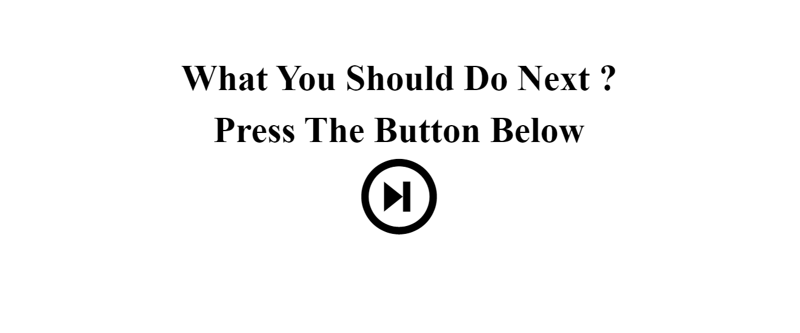

# WhatIsNext Website

The WhatIsNext website is a straightforward yet fun tool that provides suggestions for what to do next when you're feeling indecisive. This minimalist website is built using HTML, CSS, and JavaScript to call an external API for generating suggestions.

## Features

- **Single Button Interface**: A clean and simple interface with just one button.
- **Generate Suggestions**: Click the "Generate" button to receive random suggestions for your next activity.
- **Endless Possibilities**: Discover a wide range of ideas for what to do next, from leisure activities to productivity tips.

## How to Use

You can access the WhatIsNext website and get suggestions by following these steps:

1. Clone the repository:
   >git clone this repo
   >cd whatisnext-website

2. Open the `index.html` file in your web browser.

3. Click the "Generate" button to receive a random suggestion for what to do next.

## Contributing

Contributions to improve or enhance the WhatIsNext website are welcome! If you'd like to contribute, please follow these steps:

1. Fork the repository.
2. Create a new branch for your feature or improvement.
3. Make your changes, ensuring they follow best practices and maintain the website's style.
4. Submit a pull request, describing the changes and their significance.

## License

This project is licensed under the [MIT License](LICENSE).

## Contact

If you have any questions or suggestions regarding the WhatIsNext website, please feel free to contact us at mohamedaminefki0002@gmail.com .

## Acknowledgments

- Special thanks to the contributors and users who find inspiration in our simple tool.
- The website's purpose is to help you make decisions and discover new activities.

